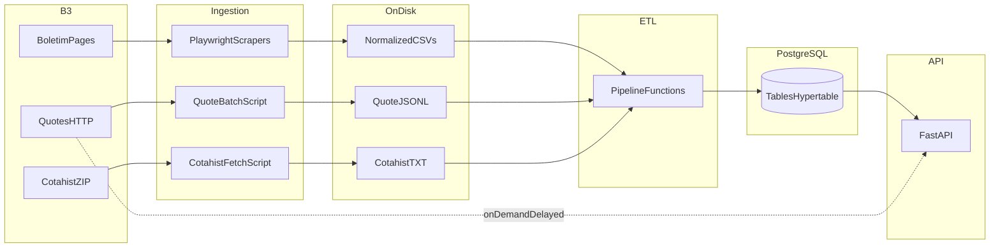

# Architecture Overview

**etl-b3** is an ETL pipeline plus HTTP API for Brazilian exchange (B3) public market data from the *Boletim Diário do Mercado* and related sources.

**Main purpose:** Ingest B3 files and API responses, normalize them, load them into PostgreSQL (with TimescaleDB for intraday series), and expose the results through a FastAPI service. Some routes also call B3’s public delayed market-data HTTP API on demand (not persisted).

**Core responsibilities:**

- Scheduled and manual scraping / downloading of source files (Playwright for bulletin pages; HTTP for quotes and COTAHIST ZIPs).
- Parsing and transforming CSV, JSONL, and fixed-width COTAHIST text into typed rows.
- Idempotent database loads with an ETL audit trail (`etl_runs`).
- REST API for assets, daily trades, daily and intraday quotes, COTAHIST history, market aggregates, and limited ETL triggers.

**Who uses it and for what:**

| Audience | Typical use |
|----------|-------------|
| **Operators** | Run Docker Compose (DB + scheduler + API), monitor logs, run one-off scripts or COTAHIST worker. |
| **Developers / contributors** | Extend parsers, flows, or API routes; run tests and local uvicorn. |
| **API consumers** | Query stored B3 data or delayed live quotes; optional ETL triggers against local CSVs on the API host. |

---

# Data Sources

| Source | What it provides | Format / protocol | When it runs | Consumed by |
|--------|------------------|-------------------|--------------|-------------|
| **Boletim Diário — cadastro de instrumentos** | Listed instruments | Normalized CSV (after Playwright download) | Prefect `daily-registry` (cron, default 08:00 America/Sao_Paulo); bootstrap / manual scraper | `daily_registry_flow` → `handoff_registry_loads_task` → `run_instruments_and_trades_pipeline` / `run_daily_quotes_pipeline` (see Prefect tasks) |
| **Boletim Diário — negócios consolidados** | Daily consolidated trades per ticker | Normalized CSV | Same as cadastro | Same handoff; loads `fact_daily_trades` and drives daily quote pipeline from negócios where applicable |
| **B3 Daily Fluctuation History (HTTP)** | Intraday price points | JSON over HTTPS (`{b3_quote_base_url}/DailyFluctuationHistory/{ticker}` — see `app/core/config.py`) | On API request (cached); also batch job during `intraday_quotes_flow` | `run_b3_quote_batch.py` → JSONL → `run_intraday_quotes_pipeline` → `fact_quotes` |
| **COTAHIST annual (SerHist)** | Historical type-01 rows | ZIP download; fixed-width `.TXT` inside | Manual CLI, Docker `cotahist` one-shot, or optional Prefect `daily_scraping_flow` flag | `run_b3_cotahist_annual.py` (fetch) + `run_etl.py` / `run_cotahist_annual_pipeline` → `fact_cotahist_daily` |
| **B3 bulletin entrypoint (web)** | Download links / pages for daily files | HTML + browser automation | Scrapers | `app/scraping/b3/` (Playwright) |

**Notes:**

- **Exchange holidays and weekends** are not modeled in code: scheduled jobs may still fire; intraday flow no-ops outside the configured quote window (`app/etl/orchestration/market_hours.py`).
- **Remote CSV mode** (`source_mode=remote`) exists in settings for some flows but **HTTP ETL triggers** reject remote mode (Playwright must run out-of-band). See `app/api/routes/etl.py`.

---

# Main Containers / Building Blocks

## Summary table

| Block | Primary responsibility | Main technology | Inputs | Outputs |
|-------|------------------------|-----------------|--------|---------|
| **API** | HTTP access to DB + optional live B3 calls; ETL triggers (local files) | FastAPI, Uvicorn; image `Dockerfile.api` | HTTP; `DATABASE_URL`; shared volume for `B3_DATA_DIR` | JSON; Scalar UI at `/scalar` |
| **Scheduler** | Recurring scrapes + handoff to pipeline | Prefect `serve`; Playwright; image `Dockerfile` | Env schedules; `scraper_data` volume; DB | Raw files under `/app/data`; DB rows |
| **Database** | Persistence + Timescale hypertable for intraday | PostgreSQL 16 + TimescaleDB (`timescale/timescaledb` image) | SQL from app | Tables listed below |
| **COTAHIST worker** | Optional one-shot annual fetch + load | Same image as scheduler; `full_stack_bootstrap` + `docker/cotahist_worker.py` | DB (migrations applied elsewhere); volume | `fact_cotahist_daily`; marker file |
| **Shared volume `scraper_data`** | Raw and intermediate artifacts | Docker volume | Scheduler / API / cotahist | CSV, JSONL, ZIP, TXT, traces, screenshots paths |

## API

- **Technology:** FastAPI (`app/main.py`), routers under `app/api/routes/`.
- **Default local URL:** `http://localhost:8000` (Compose binds `127.0.0.1:8000:8000`).
- **Docs:** Interactive Scalar at `/scalar`; OpenAPI schema at `/openapi.json` (default FastAPI).
- **Relation:** Reads/writes PostgreSQL; for `/etl/*` POST routes reads CSVs from `B3_DATA_DIR` on the API container filesystem (Compose mounts `scraper_data` at `/app/data`).

## Scheduler (Prefect)

- **Entry:** `python -m app.etl.orchestration.prefect.serve` (see `compose.yaml` `scheduler.command`).
- **Deployments:** `daily-registry` (cron from `PREFECT_DAILY_REGISTRY_CRON`, default `0 8 * * *`, timezone `America/Sao_Paulo`); `intraday-quotes` (interval from `PREFECT_INTRADAY_INTERVAL_MINUTES`, default 30, with fixed anchor in `serve.py`).
- **Intraday flow** skips when `is_within_b3_quote_window()` is false (session open/close + padding from env; defaults in `market_hours.py` / `compose.yaml`).
- **Relation:** Writes to volume and DB; does not expose HTTP.

## Database

**Tables (high level):**

| Table | Role |
|-------|------|
| `dim_assets` | Instrument master |
| `fact_daily_trades` | One row per (ticker, trade_date) from negócios |
| `fact_daily_quotes` | Daily quotes (legacy name; used by several API routes) |
| `fact_quotes` | Intraday points; Timescale hypertable on `quoted_at` when extension present |
| `fact_cotahist_daily` | COTAHIST type-01 grain (distinct from daily quote tables) |
| `etl_runs` | Pipeline audit |
| `scraper_run_audit` | Scraper task audit (Prefect / worker); **no public HTTP API** |

## COTAHIST worker (Compose profile `full` or `cotahist`)

- **Command:** `python -m app.etl.orchestration.prefect.full_stack_bootstrap` with `docker/entrypoint_cotahist.sh`.
- **Marker:** Default skip file `STACK_FULL_BOOTSTRAP_MARKER` = `/app/data/.bootstrap_full_v1.done` (see `compose.yaml`). If the marker exists and `FORCE_FULL_STACK_BOOTSTRAP` is not enabled, the worker exits without running. On success, `full_stack_bootstrap` writes the marker.
- **Worker script:** `docker/cotahist_worker.py` — waits for `fact_cotahist_daily` to exist, optional advisory locks (`COTAHIST_LOCK_KEY_1` default `4242`, `COTAHIST_LOCK_KEY_2` default `1`), runs fetch + `run_etl.py` subprocesses.
- **Does not run Alembic** — migrations must have been applied (e.g. scheduler entrypoint).

## External services

- **B3 bulletin / market pages** — HTML entrypoints used by Playwright scrapers (`settings.b3_bulletin_entrypoint_url` and related templates in `app/core/config.py`).
- **Delayed quote HTTP API (live routes + batch client)** — configured as **`b3_quote_base_url`** (default `https://cotacao.b3.com.br/mds/api/v1`). Per-ticker history is requested as **`{b3_quote_base_url}/DailyFluctuationHistory/{ticker}`** (see integrations under `app/integrations/b3/`). Do not hardcode the host only: always align with settings if B3 changes paths.
- **COTAHIST annual files** — base URL in **`settings.b3_cotahist_base_url`** (ZIPs such as `COTAHIST_A{year}.zip` under that host’s SerHist layout).

Availability and rate limits are operational risks; live API routes document in-memory cache TTL via **`b3_quote_cache_ttl`** (default 300 seconds).

---

# Macro Data Flow

**Narrative (default stack):**

1. **B3** publishes daily bulletin files and hosts historical COTAHIST ZIPs and live delayed quote APIs.
2. **Scheduler** uses Playwright to download cadastro + negócios → **normalized CSVs** on disk.
3. **Handoff tasks** invoke **pipeline** functions: instruments + trades → `dim_assets` / `fact_daily_trades`; daily quotes from negócios → `fact_daily_quotes` where configured.
4. **Intraday path:** batch job reads tickers and calls B3 HTTP → **JSONL** → `run_intraday_quotes_pipeline` → **`fact_quotes`**.
5. **COTAHIST path (optional):** ZIP → TXT → `fact_cotahist_daily` (separate from daily quote tables).
6. **API** serves stored data; some **quotes** routes call B3 HTTP directly and do not persist.



---

# Responsibilities of the Main Blocks

| Block | Role |
|-------|------|
| **`app/scraping/`** | Browser automation and file download for B3 bulletin flows. |
| **`app/etl/orchestration/prefect/`** | Flows, tasks, schedules, handoffs to DB pipelines; `serve` entry for Docker. |
| **`app/etl/orchestration/pipeline.py`** | Standalone load entrypoints (`run_*_pipeline`) used by Prefect, CLI, and API. |
| **`app/etl/parsers/` / `transforms/`** | File parsing and Polars transforms. |
| **`app/etl/loaders/db_loader.py`** | Orchestrates repository upserts inside managed sessions (callers commit). |
| **`app/repositories/`** | SQLAlchemy data access; no commits inside repositories. |
| **`app/api/routes/`** | HTTP surface; integrates use cases and repositories. |
| **`app/integrations/b3/`** | HTTP client behavior for live quotes (used by routes and batch jobs). |
| **`docker/`** | Entrypoints, optional bootstrap, COTAHIST worker, shell helpers. |
| **`scripts/`** | CLI entrypoints for operators (ETL, scrapers, Prefect daily flow, COTAHIST). |

---

# Key Repository Mapping

| Path | Maps to |
|------|---------|
| `app/main.py` | FastAPI app factory, router includes, `/scalar` |
| `app/api/routes/` | HTTP API by domain (assets, quotes, trades, fact-quotes, cotahist, market, etl, health) |
| `app/core/` | Settings (`config.py`), logging, constants |
| `app/db/` | Engine, session, SQLAlchemy models |
| `app/schemas/` | Pydantic request/response models |
| `app/repositories/` | DB access layer |
| `app/use_cases/` | Application logic (e.g. asset overview, candles) |
| `app/etl/` | Ingestion, parsers, transforms, loaders, orchestration |
| `app/etl/orchestration/prefect/` | Prefect flows, tasks, serve, full-stack bootstrap |
| `app/scraping/` | Playwright scrapers and shared browser helpers |
| `app/integrations/b3/` | B3 HTTP integration for quotes |
| `alembic/` | Schema migrations |
| `docker/` | `Dockerfile`, `Dockerfile.api`, entrypoints, init SQL, worker scripts |
| `scripts/` | Operator CLIs (`run_etl.py`, scrapers, quote batch, Prefect flow, COTAHIST annual) |
| `tests/` | pytest layout: `unit/`, `integration/`, `e2e/` |
| `data/sample` | Default `b3_data_dir` for local development (see `app/core/config.py`) |
| `compose.yaml` / `compose.override.yaml` | Multi-service runtime |

---

# Operational Notes

## How the system is usually run

- **Full stack:** `docker compose build` then `docker compose up -d` — starts `db`, `scheduler` (Prefect serve), and `api` ([compose.yaml](../compose.yaml)).
- **Database only for local dev:** `docker compose up -d db` then `alembic upgrade head` on the host, then `uv run uvicorn app.main:app --reload`.

## Compose files

- **`compose.yaml`** is the base stack.
- **`compose.override.yaml`** is merged automatically when you run `docker compose` without `-f`; it enables API hot reload and bind-mounts `./app` for the **api** service only. To run without dev overrides: `docker compose -f compose.yaml up`.

## Scheduler image and code changes

The **scheduler** service does **not** mount `./app` in the base compose file. After changing Python under `app/`, rebuild and recreate: e.g. `docker compose build scheduler && docker compose up -d --force-recreate scheduler`.

## Migrations

The scheduler **entrypoint** runs `alembic upgrade head` before Prefect (see `docker/entrypoint.sh`). The **cotahist** service does not run migrations; it waits until `fact_cotahist_daily` exists.

## Bootstrap vs cron

`SKIP_STACK_BOOTSTRAP_IF_FRESH` (default in Compose) can skip light stack bootstrap when today’s cadastro CSV already exists; scheduled `daily-registry` may still run. See `.env.example` and entrypoint behavior.

## Intermediate artifacts

Mounted volume **`scraper_data`** → `/app/data` in containers. Typical env: `B3_DATA_DIR=/app/data/raw`, COTAHIST under `B3_COTAHIST_ANNUAL_DIR` (Compose default `/app/data/raw/b3/cotahist_annual`). Screenshots/traces paths are configurable (`b3_screenshots_dir`, `b3_trace_dir`).

## ETL audit pattern (pipelines)

Pipeline functions in `app/etl/orchestration/pipeline.py` use separate transactions for: (1) start `etl_runs`, (2) data load (atomic rollback on failure), (3) finish `etl_runs`. Repositories do not call `commit()`; the managed session commits once per load batch. **Exception:** some COTAHIST batch modes and flags may skip or consolidate audit rows — see docstrings in `pipeline.py` and `scripts/run_etl.py`.

## Manual commands (examples)

```powershell
docker compose exec scheduler /app/docker/run_daily_batch.sh
docker compose exec scheduler /app/.venv/bin/python /app/scripts/run_etl.py
docker compose exec scheduler /app/.venv/bin/python /app/scripts/run_b3_quote_batch.py
docker compose --profile full run --rm cotahist
```

## Healthchecks

Scheduler healthcheck greps for `app.etl.orchestration.prefect.serve` — if the module path changes, update [compose.yaml](../compose.yaml).

---

# Related documentation

- [data-dictionary.md](data-dictionary.md) — entities and API consumer guide.
- [README.md](../README.md) — quick start and common commands.
- [.env.example](../.env.example) — environment variable reference.
